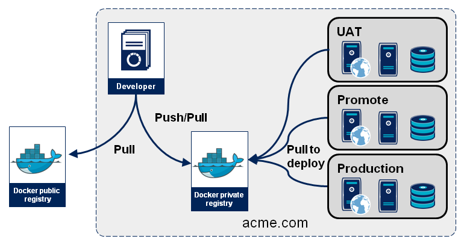

<!--
theme: default
paginate: true
-->
<style scoped>
pre {
   font-size: 2rem;
}
</style>


# Introducción y uso básico I

---
# Indice

- ¿Qué es Docker y para que se usa?
- Conceptos básicos
    - Imágenes
    

---

# ¿Que es Docker y para que se usa?

- API para el control y organización de contenedores Linux
    - https://linuxcontainers.org/
- Se usa porque:
    - Configuración rápida y simple de los proyectos
    - Resilente, lo que funciona en tu PC, funciona en cualquier otro...99%
    - Control de versiones
    - Empaquetado distribuido (Registry)

---
#### Ciclo de vida de aplicación con docker
- Escribimos aplicación
- Dockerfile
- Construimos Imágen
- Subimos a registro Privado
- Desplegamos en producción desde registro

---
#### Arquitectura de servicios


---
# Imágenes
- Es una representación estática de una aplicación o servicio
- Sirven para crear Contenedores
- Aumentan la reutilización
- Se Almacenan en repositorios
- Se construyen con un fichero llamado Dockerfile
---
### De dockerfile al contenedor


---
### Registry
- El registro es un repositorio remoto donde podemos subir diferentes versiones de nuestras imágenes para que sean accesibles por procesos automáticos o por otros desarrolladores
- Repositorios Públicos: Aquellos que son accesibles por todos (OSS)
- Repositorios Privados: Aquellos que son accesibles mediante credenciales (Software Privado)



---
### Dockerfile
- Ejemplo Dockerfile
```docker
FROM debian

RUN apt-get update && apt-get install -y apache2 && apt-get clean && rm -rf /var/lib/apt/lists/*

ENV APACHE_RUN_USER www-data
ENV APACHE_RUN_GROUP www-data
ENV APACHE_LOG_DIR /var/log/apache2

EXPOSE 80
ADD ["index.html","/var/www/html/"]

ENTRYPOINT ["/usr/sbin/apache2ctl", "-D", "FOREGROUND"]
```
---
## Conceptos y Comandos

---
### Listar
- Ver imágenes de docker en el sistema
Podemos ver las imágenes creadas y las descargadas con el comando ls
```
docker image ls
```

- Con el parámetro -a nos listará todas las imágenes incluidas las ocultas
```
docker image ls -a
```
- Nos indicará 

```
REPOSITORY  TAG IMAGE   ID  CREATED   SIZE
```
---
### Tags
- Los tags son los nombres con los que podemos referirnos a una imágen de una manera mas fácil que el ID de la imágen
```
docker image tag pepe/apache2 registry.lambdamotive.com/apache2
```

- Los tags son útiles también para determinar el registro
 **registry.lambdamotive.com/apache2**
 - Podemos tener múltiples TAGS para la misma imágen

---
### Construir Imágenes

- Para construir imágenes usamos:
Buscará el fichero Dockerfile en la ruta donde se ejecuta el comando
```
docker build -t pepe/apache2 .
```
- Con el parámetro -t le pondrá un TAG durante la creación
---
### Construcción y Caché
- Cuando construimos imágenes Docker intenta ser optimo separa los pasos del dockerfile en "bloques" únicos, si hemos modificado la última linea de un dockerfile todos los pasos anteriores los cogerá de la Caché

Para evitar que haga esto podemos usar el comando --no-cache
```
docker build -t pepe/apache2 . --no-cache
```
---
### Logearnos en un registro

Nos podemos loguear en registros privados con el comando login

```
docker login registry.lambdamotive.com
```
---
### Subir imágen Registry

- Para subir una imágen a un registro público (dockerhub):
```
docker image push pepe/apache2
```
- Para subirla a un registro concreto, le ponemos un tag con el nombre del registro
```
docker image tag pepe/apache2 registry.lambdamotive.com
docker image push registry.lambdamoteive.com/palmeras
```

---

### Actualizar Imágen Local
- Eliminar una imágen de docker
```
docker pull pepe/apache2
```
---

### Eliminar Imágen
- Eliminar una imágen de docker
```
docker image rm pepe/apache2
```
---

### Limpiar imágenes no usadas
- Muchas veces nos encontramos con muchas imágenes en el sistema que ocupan un espacio considerable

El comando image prune, limpiará todas las imágenes no usadas por los contenedores.
```
docker image prune -a
```
---
### Otros Comandos
- Guardar imágen en archivo **save**
```
docker image save -o fichero.tar
```
- Cargar imágen de archivo **load**
```
docker image load -i fichero.tar
```
---
### Demo Práctica
**BirthFinder**
*Ni un cumpleaños más sin su palmera*
